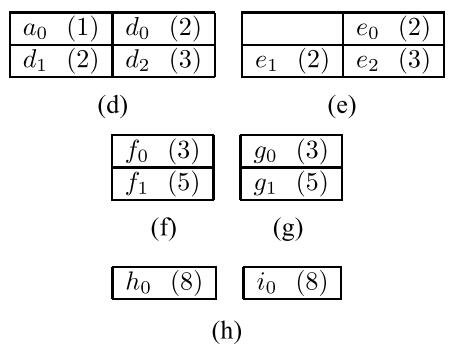

## Compression of 3D Point Clouds Using a Region-Adaptive Hierarchical Transform
Published on TIP'16
### 简介
作者介绍了一个范围自适应的正交变换用于压缩3D点云的颜色信号，这种方法不仅在RD-curve上表现优秀，同时具有较低的计算复杂度能够支持实时性的要求。这个变换方法是多层次的，对熵编码有很好的正向促进。
### RAHT
RAHT沿着xyz三个方向在八叉树上自底向上聚合体素信号。对$l$层的平均体素颜色信息$g_{l,x,y,z}$来说，沿着x方向的聚合过程可以被认为是
$$ \left[ \begin{array}{c} g_{l-1,x,y,z}\\ h_{l-1,x,y,z} \end{array} \right] = \mathbf{T}_{w_1 w_2} \left[ \begin{array}{c} g_{l,2x,y,z}\\ g_{l,2x+1,y,z} \end{array} \right]  $$
其中，$w_1=w_{l,2x,y,z},w2=w_{l,2x+1,y,z}$分别表示对应体素所包含的叶节点数目，而
$$ \mathbf{T}_{w_1w_2}=\frac{1}{\sqrt{w_1+w_2}}\left[\begin{array}{cc} \sqrt{w_1} & \sqrt{w_2} \\ -\sqrt{w_2} & \sqrt{w_1}\end{array}\right]$$
是实际的变换，变换系数随着空间结构自适应改变。$g_{l,x,y,z}$ 被用于继续合并更上层，而 $h_{l,x,y,z}$ 是high-pass的系数，可以用于量化和编码。对一组八个体素来说，聚合过程分三个维度进行，比如x->y->z。并且由于 $\mathbf{T}_{w_1w_2}$ 都是正交的，所以整个变换是正交的，这对于压缩来说是十分有意义的，因为在变换域中量化误差的常数在信号域中保持不变。
 
上图是一个2D四叉树的示例，图a中有8个点，首先在x维度进行一次聚合形成图b中的7个点，这7个点是量g，而c中的c0则是聚合a6a7得到的high-pass的h。接着图b在y方向上进行聚合得到图d，e0，e1，e2是得到的high-pass的h。图d是高层的四叉树，再对d进行聚合生成f，图g是high-pass。对图f进行最后一次聚合得到h和i。需要进行编码和传输的coefficient是c0 e0 e1 e2 g0 g1 i0和h0，详细的变换过程如下图。

随后，变换系数将被按照对应w的值划分为若干个sub-band，由于w的值和几何信息相关，所以编解码器可以自然的获取到这些信息。例如 1111111111111121223358， 222 33 5 8划分为3个sub-band，分别使用算术编码进行计算，并且通过量化参数来计算算术编码的最佳参数发送到解码器。