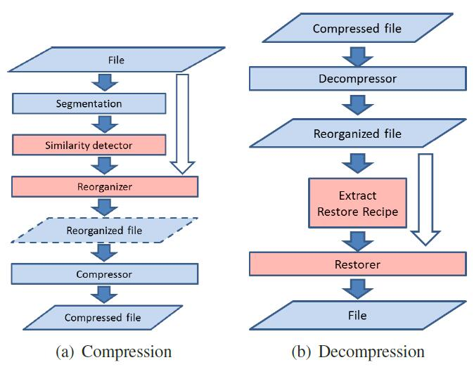

## Migratory Compression: Coarse-grained Data Reordering to Improve Compressibility -- FAST'14
Xing Lin, Guanlin Lu, Fred Douglis, Philip Shilane, Grant Wallace

### Single-File Migratory Compression

#### Similarty Detection with Super-features
第一步是将数据分成chunks，chunk可以是固定大小，也可以是可变大小的。根据文献，可变大小的块效率更高，但是很多系统使用的是固定大小的块，这里作者默认使用可变大小的块。问题在于如何高效地、可调节地识别相似的chunk。一般地，可以通过similarity features：相似的两个chunks会共享很多features。虽然可以通过枚举来找到最相似的匹配，但是通用的近似方法是将feature聚合成为super-features(SFs)。两个数据对象在有一个SF一致时就可能十分相似，这也是最常用的方法。

 NOTE:什么是Super-Features和Similarity Features，具体计算方式是什么，需要了解吗？

这里作者使用了 一个名为"First-Fit"的贪婪匹配算法，每个块在处理过程中，它的N个SFs在N个哈希表中进行搜索。如果有匹配的SF，那么这个块就会和共享SF的块联系起来，如果没有匹配的SF，这个块就会被加入到N个哈希表中以供后面的查找。<h style="color:gold"> 匹配的块应该也要加入吧，相似而不是相同。</h> 作者探索过在每个SFs上排序所有chunks来搜索复数个SFs匹配的块而非单个匹配的块，虽然这种方法确实勉强提升了压缩率，但是带来了不相称的计算开销。

#### Data Migration and Reconstruction
在得到相似的chunks的信息之后，mzip方法将进行Migration和Restore。相似的chunks将会被排在一起，按照它们在文件中的偏移量进行排序。并且得到一个迁移表，表中内容为重排之后的chunk在原始文件中的编号，同时还有一个恢复表，指示原始文件的每个位置上应该放置哪个重排过的chunk。同时，完全一致的chunk将被省略。以下是几种移动chunk的策略：
1.In-Memory：当文件满足In-Memory的要求的时候就可以将文件读入内存，然后输出排序好的chunk序列。
2.Chunk-Level：当无法满足In-Memeory时，可以按照迁移表的顺序将chunk依次读入输出。当使用机械硬盘时，效率会因为随机存取而极大降低。
3.Multi-pass：扫描原始文件多次，每一次将对应次序的chunk放入内存缓冲区内，可以有效避免随机存取。

#### mzip Workflow

蓝色部分使用的是现有的结构，而红色部分是作者特殊设计的方法。文件被读分割器，计算加密特征用于去重复，接下来被重排并压缩。

### Intra-file Delta Compression
作者假设mzip算法会比Delta压缩算法优秀，为了验证这一想法，作者以上图的流程实现了一个Delta压缩算法并做了实验。

### Migratory Compression in an Archival Storage System
虽然MC可以有效减少系统存储空间的开销，但是这种方法会破坏数据读取的局部性。这种性能上的惩罚使得MC算法更适合与那些对读取性能要求比较小的系统，比如档案系统。当档案系统作为备份系统中的一员时，数据会定期大量迁移，这就给了MC算法很好的机会去进行块的重排。
这里作者实现了一个Data Domain File System，这个系统中的块在经过数据去重之后被聚合到若干compression regions中，区域又被聚合到容器中。DDFS支持两种存储层，一种活跃的用于备份，另一种长期的用于档案。MC算法对于那些在乎长期数据存储中每GB开销的用户比较重要。
一个名为data migration的守护进程被用于进行MC算法，出于性能角度的考虑，在活跃存储中的数据通过简单地LZ算法压缩，而档案存储层中的数据通过gzip算法压缩，整个流程如下：
1.Similarity Range：相似度检测局限于一次迁移中的文件，例如2周或者90天内写入的文件。
2.Super-features：作者使用了12个相似度特征，集合为3个SFs。对于每个要被迁移的容器，作者读取元数据，提取和每个chunkl相关联的SFs，再将SFs和chunk的指纹写入到一个文件中。
3.Clustering：chunks被聚合到similar fashion中，依据一个贪婪的单个SF匹配算法，但是这里是排序而非哈希表。<h style="color:gold">什么排序？</h>
4.Data reorganization：首先选择最大的类似数据块集群的前三分之一，然后是较小的集群，最后是不相似的数据块。由于数据块是由三个SF分组的，因此使用了三个Bloom过滤器来识别在每个遍历中需要哪些数据块。然后将需要的数据块复制到为特定数据块的SF指定的CR中；如果CR达到最大容量，则将其刷新到磁盘。

由于DDFS本身就有一个将文件映射到chunks的树结构，因此重排chunks并不会对性能产生太大影响，同时也不需要一个恢复表。