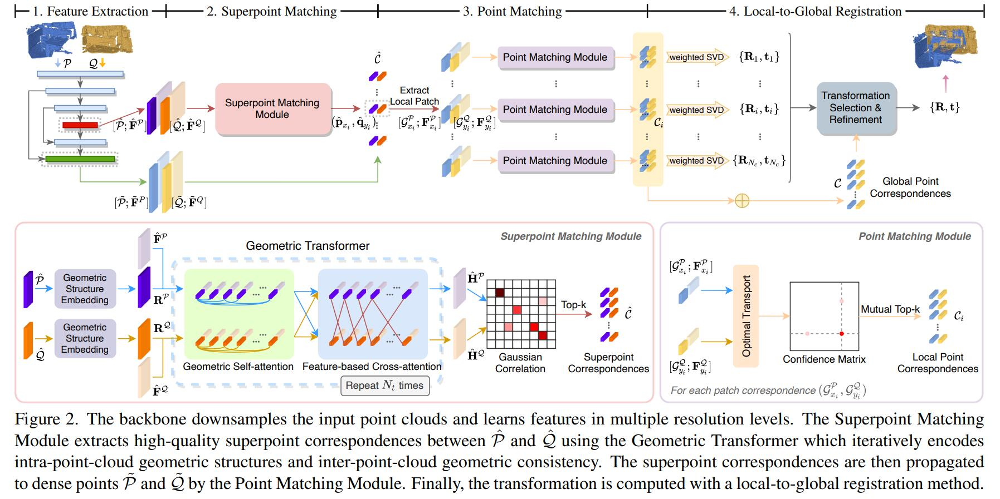
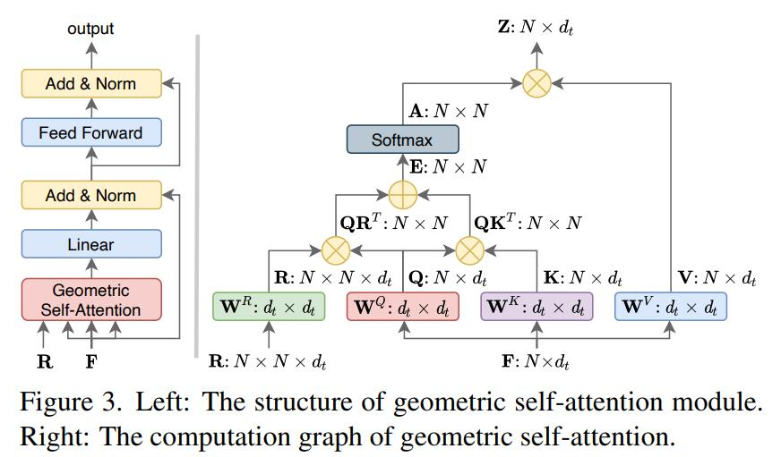

# Geometric Transformer for Fast and Robust Point Cloud Registration--CVPR'22
[原文](../paper_pdf/geometric_transformer.pdf)
## 简介
本文通过提取superpoint来对patch的特征进行总结，利用transformer实现高效且精确的registration。

## superpoint采样和特征提取
原始点云通常太过稠密，因此以点为单位的匹配是冗余的并且有时太密集导致可用性下降。在这里，本文对稠密点云进行了降采样，采样使用体素滤波，即每个体素单元内的所有点被体素的重心取代，这些重心被作为superpoint进行特征提取。 
## superpoint匹配

本文将几何信息和特征一起使用attention机制进行处理，几何信息经过geometric embedding。之后两帧的特征进行cross-attention，每一帧自身的特征作为query，另一帧的特征作为key和value。
## 点匹配
在superpoint匹配之后，每个patch对之间进行基于gnn的点特征匹配，生成最佳匹配点对。
## local-to-global registration
对每个patch利用SVD可以生成一个变换，统计每个变换应用在全局的匹配对之间的误差小于$\tau_a$的数目，取最高的变换作为全局的结果