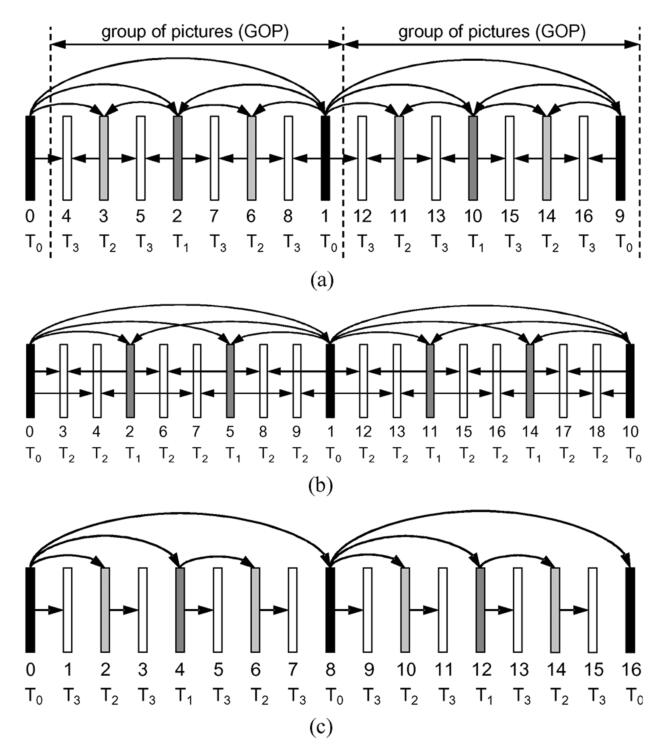
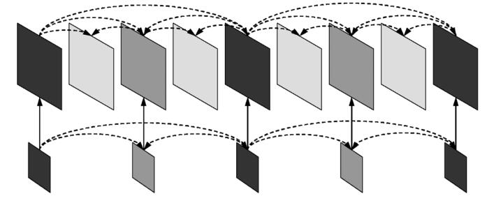
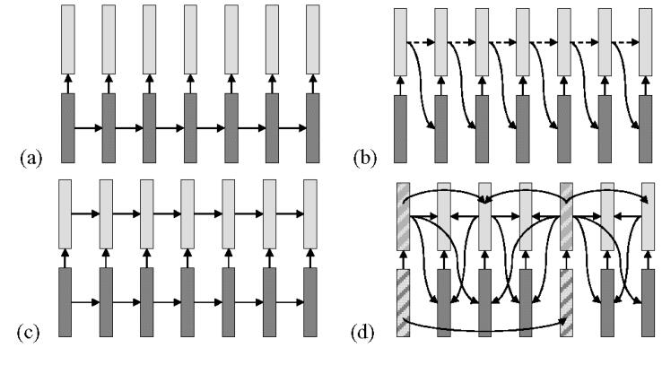
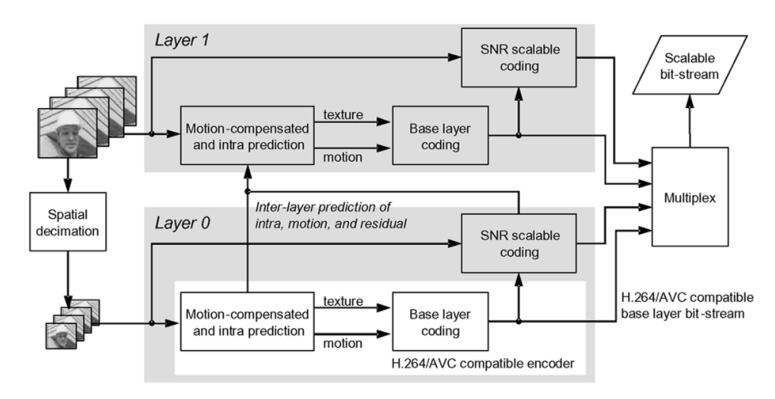

# Overview of Scalable Video Coding Extension of the H.264/AVC Standard
## Introduction
现代的视频传输存储系统基于RTP/IP网络，而RTP/IP网络具有广泛的连接质量和接收设备，从智能手机上的小屏幕到高性能PC上的高分辨率屏幕等。分级视频编码（SVC）用于解决视频系统中质量差异的问题，SVC包含一个或多个子集比特流，比特流可以使用H.264等编码器进行解码并拥有一致的数据量。然而SVC拓展很少被使用，原因在于SVC的分级特性伴随着编码效率的明显损失以及解码器复杂度的显著提高。此外联播多个码流和视频转码功能也可以实现类似SVC的效果，因此SVC也需要和他们竞争。
## Type of Scalability, Applications, and Requirements
可伸缩性就是从视频流中去除一部分数据，该流仍可以解码，视觉质量低于完整的流但是高于继续去除后的流，不具备可伸缩性的流称为单层比特流。通常来讲，可伸缩性包括空间（图片大小）、时间（帧率）和质量（SNR）。在SVC下源数据只需编码一次以获得最高的分辨率和比特率，产生可伸缩的比特流，通过丢弃特定数据获取分辨率、质量较低的表示。在监控应用中，使用SVC的视频可以在一段时间后删除掉高质量的部分，只留下低质量的部分供长期存档。
虽然SVC有很多优点，但是空间和质量伸缩始终以增加解码器复杂度和降低编码效率为代价，因此很少使用。但是时间伸缩可以提高编码效率，因此通常使用这种形式。SVC要做到以下几点
$\bullet$ 每个SVC子集具有和单层编码近似地编码效率。
$\bullet$ 解码器的复杂度增加很少。
$\bullet$ 支持时间、空间、质量可伸缩。
$\bullet$ 支持向后兼容的基础层，例如H.264
$\bullet$ 编码后支持简单的比特流自适应。

## H.264/AVC Basis
SVC作为AVC的拓展进行标准化。AVC的设计包括了视频编码层VCL和网络抽象层NAL，VCL创建源视频的编码表示，NAL格式化这些数据使VCL数据能够被各种系统利用。

## Basic Concepts for Extending H.264/AVC Towards and SVC Standard

### Temporal Scalability 
将一组access单元（图片）划分为一个时序基础层和若干时序增强层以构成时序伸缩。时序层从0开始编号为$T_0\sim T_n$，对给定的$k$将所有大于$k$的层移除以构成另一个比特流供解码器解码。
(1) Hierarchical Prediction Structures
二元时间增强层如Fig.1(a)所示，基础层的图片被作为I帧和P帧进行编码，即$T_0$层，而增强层的图片使用双向B预测编码，任一组$T_0\sim T_k$层都可以独立解码，只要$k<n$。多参考图片结构如Fig.1(b)所示，并且参考图片可以与预测图片具有相同的时间层级。通过限制编码顺序可以有效调整编解码之间的延迟，如图Fig.1(c)所示。每一帧都只参考于之前的帧，但是这种方式会降低编码效率。
对基本层的图片应该以最高的保真度进行编码，而对下面的时间增强层应该选择较大的量化参数。给定基本层的量化参数$QP_0$，时间增强层的参数$QP_T=QP_0+3+T$，这种方式虽然会导致较大的PSNR波动，但是主观上解码后的视频是平滑的。当使用两个以上时间层的B帧时，时间直接模式会为大约一半的B帧推断出不合适的MV，因此最好使用空间直接模式。
(2)  Coding Efficiency of Hierarchical Prediction Structures
  

### Spatial Scalability

每一个空间层对应一个分辨率，编号从基础层$D_0$开始递增。每一层都使用帧内预测和帧间预测进行编码，为了进一步提高编码效率，还引入了层间预测的机制。SVC规定所有空间层使用一致的编码顺序，不同分辨率的图片表示形成一个access单元，底层的图片不需要出现在所有的access单元中，这就使得时间和空间伸缩结合起来。
(1) Inter-Layer Prediction
层间预测的目的是为了更好的利用低层次的信息来提高增强层的RD效率。预测信号通过增强层内的动作向量预测、上采样底层重建信号或者对上采样信号和时序信号平均来进行构建。层间预测通常要与时间预测进行竞争，SVC添加了两个额外的层间预测概念，宏块模式与相关运动参数预测以及残差信号预测。
**Inter-Layer Motion Prediction**：对空间增强层，SVC包含一种新的宏块，这种宏块只有残差信号无辅助信息，通过低层的同一位置宏块导出增强层宏块的数据和MV。增强层宏块的划分是低层宏块划分的2倍，即低层$8\times 8$对应增强层$16\times 16$，低层$8\times 4$对应增强层$16\times 8$。当一个*motion prediction flag*为1时增强层宏块使用低层宏块缩放的MV，否则使用相对于参考图片使用H264的预测。
**Inter-Layer Residual Prediction**：对所有使用帧间编码的宏块都可以使用这个预测方式。当使用这个方式时参考层的宏块中的残差信号通过双线性滤波器进行上采样，从而作为增强层宏块残差信号的预测，增强层宏块只需编码针对预测的差分信号。这个上采样是在变换的块上进行的，以确保不跨变换块的边界应用滤波，从而产生干扰信号分量。
**Inter-Layer Intra-Prediction**：对层间预测的增强层，如果参考层的宏块是帧内编码的，那么就应用这种方式进行预测。将参考层的亮度分量使用一维四抽头FIR滤波器进行垂直和水平的上采样，将色度分量使用双线性滤波器进行上采样，滤波用相邻的帧内块进行跨边界的采样，若相邻块非帧内编码则使用边界扩展算法，同时在上采样之前对参考层的信号使用H264解块滤波器。
(2) Generalized Spatial Scalability
SVC支持任意分辨率的空间伸缩编码，唯一的限制是水平和垂直分辨率都不能从一层下降到下一层。SVC还包括了增强层的图片仅表示其相应参考层图片某一个特定部分，或者超出参考层图片边界的附加部分。SVC还包括了对隔行信源的空间可伸缩编码。
(3) Complexity Considerations
可以通过限制层间帧内预测的使用来显著降低解码器的复杂度，虽然这种方式能够提高编码效率。
(4) Coding Efficienc
  
(5) Encoder Control
一种方法是将增强层的参数$QP_E$设为$QP_B+4$.

### Quality Scalability
质量伸缩可以看做空间伸缩的特殊形式，即基本层和增强层的大小相同，不采用空间伸缩中的上采样方法，然而这种概念仅支持少数给定的比特率。SVC中还添加了一个这种方法的变体称为中粒度质量可伸缩性。这种概念下任何增强层的NAL单元均可被丢弃。

(1) Controlling Drift in Quality Scalable Coding
在MPEG-4的设计中，完全忽略了漂移问题，增强层只参考于基本层，因此丢弃增强包不会对运动补偿循环产生任何影响。与单层编码相比，这种方式降低了增强层的编码效率，因为参考帧固定。在上图的(b)中描述了H262采取的方式，这种方式可以实现高效地增强层编码并确保了低复杂度，但是任何质量增强包的丢失都会导致漂移。替代方案是图中的(c)虽然基础层不受增强层中分组丢失的影响，但是会导致增强层的漂移。
在SVC中引入了一个关键图片的概念。每个图片传输一个标识，该标识指示运动补偿的参考图片是基础层还是增强层。为了限制解码开销，SVC规定关键图片的基本层和增强层之间的运动参数不变。最低时间层的所有图片都被作为关键图片，时间细化图片使用具有最高质量的参考图片做运动补偿。
(2) Encoder Control
编码过程中不知道解码器中可用的表示，有几项研究证明当编码器采用重建质量最高的参考时通常可以获得良好的编码效率。
(3) Bit Stream Extraction
从给定质量伸缩比特流中提取具有特定平均比特率的子流通常存在大量的可能性。相同的平均比特率可以通过丢弃不同的质量单元来进行调整，一种方法是随机丢弃直到符合要求，还有一种方法是编码器分配一个优先级标识符，每次丢弃优先级最低的单元。
(4) Coding Efficiency
 
(5) SVC-to-H.264/AVC Rewriting
对层间帧内预测，预测信号不是由参考层帧内信号构成，而是从同一位置的参考层块中推断出空间帧内预测模式，然后在增强层中执行单层的H264帧内预测。残差信号的预测在变换系数等级域中进行，即并不是缩放过的变换系数，而是变换系数的量化水平被缩放和累计。意思是残差信号在变换后与基本层系数反量化后的值相减，再进行量化并传输。这种修改可以保证SVC比特流能够转换为不可缩放的H264比特流。

## SVC High-Level Design

### Combined Scalability
如上图所示，例子是一个两空间层的编码器结构，每层通常表示一个特定的空间分辨率，不同的层提供粗粒度的质量可伸缩性。每个依赖层中的质量细化层由质量标识符$D$标识，当依赖层的参考层包含不同质量表示时，需要指明其中哪一层用于层间的预测。质量层始终使用前一层作为层间预测的参考。
空间依赖层的切换只能在确定的某些切换点处进行，而质量层的切换可以在任意的access单元处进行。质量层可以被作为另一个空间依赖层或者一个额外的质量细化层进行传输。
在SVC中由于层间预测只能在access单元中从低层向高层进行，因此空间与质量的伸缩可以很容易地与时间伸缩进行结合。

### System Interface
SVC的一个目标是支持简单的比特流操作。为了提取伸缩的子流应该从比特流中移除一部分不需要的NAL单元。因此每个NAL单元都需要具有空间、时间和质量标识符等参数，同时需要知道高层的层间预测需要哪些NAL单元。
