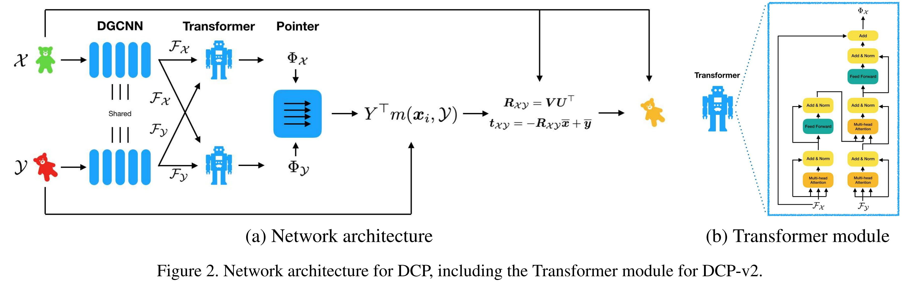

# Deep Closest Point: Learning Representations for Point Cloud Registration.--ICCV'19
## 简介
本文以深度学习的方法重构经典的ICP算法，提出了名为DCP的算法，用于对两个点云之间的刚性变换进行基于深度学习的预测。
## 问题陈述
$\mathcal{X}, \mathcal{Y}$代表两个点云，$\mathcal{X}=\{x_1,...,x_i,...,x_N\}\in \mathbb{R}^3, \mathcal{Y}=\{y_1,...,y_i,...,y_M\}\in \mathbb{R}^3$，这里先假设$M=N$，并且本文的方法可以很轻松地被拓展到不相等的情况。假设$\mathcal{Y}$是由$\mathcal{X}$经过刚性变换得到的，刚性变换为$[R_{\mathcal{X}\mathcal{Y}}, t_{\mathcal{X}\mathcal{Y}}]$，目标是最小化MSE:
$E(R_{\mathcal{X}\mathcal{Y}}, t_{\mathcal{X}\mathcal{Y}})=\frac{1}{N}\sum_{i}^{N}\|R_{\mathcal{X}\mathcal{Y}}x_i+t_{\mathcal{X}\mathcal{Y}}-y_i \| $。本文的目标是使用学习的方法来重现一个更好的匹配，之后再使用这个匹配来计算刚性变换。

## Deep Closest Point
### 初始特征
对于初始特征的提取，本文从PointNet和DGCNN两个模型中选择了DGCNN。首先，PointNet提取的是全局特征，而DGCNN提取的是点特征，而本文需要的是每个点的特征来进行特征点匹配，同时DGCNN还考虑了局部近邻的信息，因此这里选择DGCNN，并用实验证明了选择的正确性。
### Attention
为了使模型能够适应不同任务的需要，比如处理有机体形状和尖锐的机械物体需要的特征区别很大。因此本文使用了基于注意力的模型。$\mathcal{F}_\mathcal{X},\mathcal{F}_\mathcal{Y}$是DGCNN提取出的特征，这里的注意力模型的任务就是学习一个函数$\phi:\mathbb{R}^{N\times P}\times \mathbb{R}^{N\times P}\rightarrow \mathbb{R}^{N\times P}$。

通过这个函数，就获得了新的特征$\Phi_\mathcal{X}=\mathcal{F}_\mathcal{X}+\phi(\mathcal{F}_\mathcal{X},\mathcal{F}_\mathcal{Y}), \Phi_\mathcal{Y}=\mathcal{F}_\mathcal{Y}+\phi(\mathcal{F}_\mathcal{X},\mathcal{F}_\mathcal{Y})$，对这个特征再做co-attention生成最终的特征
### 点生成
通过特征的匹配，该模型为每个$\mathcal{X}$内的点生成一个针对于$\mathcal{Y}$内点的概率即$m(x_i,\mathcal{Y})=softmax(\Phi_\mathcal{Y}\Phi_{x_i}^T)$
### SVD模块
首先根据概率生成一个平均匹配点$\hat{y_i}=Y^Tm(x_i,\mathcal{Y})$，在获得了匹配点之后，就可以按照匹配点进行SVD分解并最终得到变换矩阵。