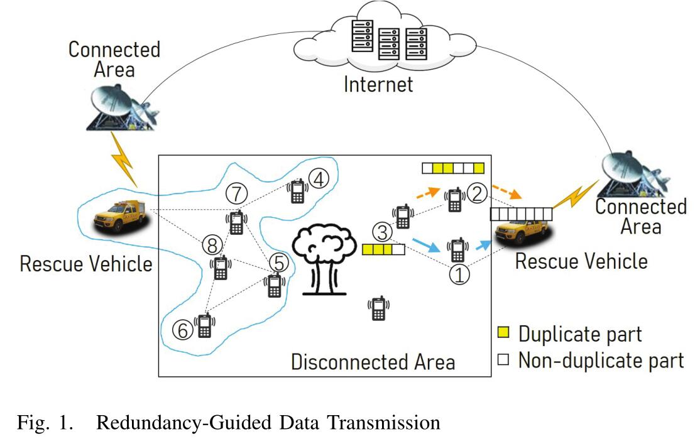

## Deduplication-Oriented Mutual-Assisted Cooperative Video Upload for Mobile Crowd Sensing
### Introduction
问题有以下几点：
1.现有的去重复方法主要关注文字和图片，视频内容和环境更加复杂。
2.在本文的设定下，重复的视频更可能出现在地理位置接近的条件下，因此在全局数据中搜索是不明智的
贡献有以下几点：
1.作者建立一个D2D协作感知视频的产生-存储-传输范式。
2.作者将去重复导向的D2D协作视频上传问题定义为一个多阶段决策问题，并给出了相关算法。
3.进行了充分的实验对文章进行了论证。
### Redundancy-guided Data Transmission Framework
#### System Architecture

当灾难发生时，许多移动设备会拍摄相同场景的视频从而产生大量的冗余。由于灾难的影响，这些设备的网络连接状况很差，使得视频无法直接传输到外界，需要通过救援车进行中转。一部分设备无法直接连接到救援车，从而需要经过其他设备与救援车进行连接。对非重复的数据沿着最近的路由进行传输，重复数据作为一种信息素沿着数据重复率较高的路径进行传输。
#### Fundamental Assumptions

如图2，一个视频需要通过三个阶段来到达终点。在产生阶段每个视频得到一个独一无二的ID，五元组包含视频的起源、开始时间、大小和传输终点。在暂存阶段视频被保存在节点中，而在传输阶段，视频从一个节点传送到另一个节点。
#### Mutual-Assisted Video Transmission

实际上，单边转发会导致负载不平衡和交通拥塞，因此需要进行互助数据传输。
#### Video Processing and Forward Strategies
当接收到数据时，对数据进行一个相似度计算，当相似度大于一个阈值时删除数据，否则保留数据，这种默认的处理策略也被称为保留策略。同时，相似度小于一个阈值的数据被通过最短路径进行传输。