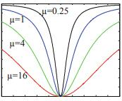
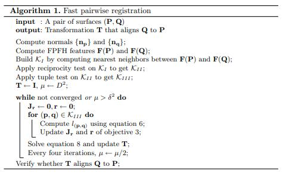

# Fast Global Registration--ECCV'16
[原文](../paper_pdf/Zhou2016_Chapter_FastGlobalRegistration.pdf)
## 简介
本文介绍了一种全局的快速配准算法，该算法不需要初始条件并且可以对齐有噪声的部分重叠点云。在该算法进行过程中不需要最近查询，因此不仅仅在对齐精度上，同时在速度上超过了SOTA算法。
## 成对点云全局配准
对点云$P,Q$，任务是找到一个从$Q$到$P$的刚性变换$T$，点之间的匹配关系通过快速的特征匹配来建立，并不会在算法进行中再重复计算，因此对变换的计算必须可以在不那么准确的匹配关系中进行。即对于匹配关系集合$\mathcal{K}$，错误的关系必须被全部禁用。算法的目标为以下形式：$E(T)=\sum_{(p,q)\in \mathcal{K}} \rho(\|p-Tq\|)$，其中$\rho(\cdot)$是一个强大的惩罚函数。在本文中，作者使用了Geman-McClure评估函数$\rho(x)=\frac{\mu x^2}{\mu+x^2}$，函数图像如下图，在x为0时取得最小值0，在x趋近于正负无穷时取得最大值1，并且随着$\mu$的减小，值的变化越剧烈。

整体的优化过程为$E(T,\mathbb{L})=\sum_{(p,q)\in \mathcal{K}}l_{p,q}\|p-Tq\|^2+\sum_{(p,q)\in \mathcal{K}}\Psi(l_{p,q})$，其中$\Psi(l_{p,q})=\mu(\sqrt{l_{p,q}} - 1)^2$，对每个$l_{p,q}$求偏导数$\frac{\partial E}{\partial l_{p,q}}=\|p-Tq\|^2+\mu\frac{\sqrt{l_{p,q}}-1}{\sqrt{l_{p,q}}}=0$，得到$l_{p,q}=(\frac{\mu}{\mu+\|p-Tq\|^2})^2$，将$l_{p,q}$代回到$E(T,\mathbb{L})$中，就能够得到$E(T)$，因此优化二者是等价的。

线性化$T=\xi=(\omega,t)=(\alpha,\beta,\gamma,a,b,c)$，$T\approx\begin{pmatrix}1&-\gamma&\beta&a \\ \gamma&1&-\alpha&b \\ -\beta&\alpha&1&c\\ 0&0&0&1\end{pmatrix}T^k$，使用高斯牛顿法进行优化，解决$J_r^TJ_r\xi=-J_r^Tr$，$r$是残差向量，而$J_r$是雅克比矩阵。

选择匹配点对的方法是对每个点求解它们的FPFH，对每个点在另一个点云中求FPFH的最近邻点。另外这些点集还需要经过两次优化，第一次是双向测试，即$F(p),F(q)$必须同时是互相的最近邻点。第二次是紧密度测试，随机挑选三元组$(p_1,p_2,p_3),(q_1,q_2,q_3)$，满足$\tau<\frac{\|p_i-p_j\|}{\|q_i-q_j\|}<1/\tau,\tau=0.9$

